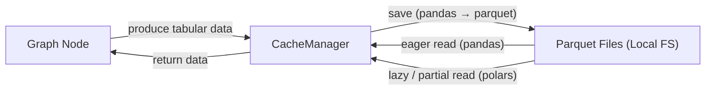

# Node Cache Manager Migration — Portfolio Case Study (Anonymized)

## Executive Summary
I replaced a legacy node-level cache with a new cache manager designed for **reliable local persistence** and **efficient access to large tabular data**.

The migration moves storage from a custom HDF5-based approach to **Parquet**, and introduces an optional **lazy/partial read path via Polars** for preview-like scenarios.

This cache stores intermediate datasets produced by nodes in a graph-based pipeline and keeps remote references as references rather than persisting them.

---

## Repository Map
- `code/new_cache_manager.py` — new `CacheManager` with Parquet persistence and optional Polars reads.
- `code/old_cache_manager.py` — legacy cache using HDF5 + storage handlers.
- `docs/before-after.md` — before/after comparison table.
- `docs/design-tradeoffs.md` — short trade-off notes.
- `diagrams/cache_read_write_flow.mmd` — Mermaid diagram source.

---

## What This Case Study Shows
- Migration-focused cache redesign (HDF5 → Parquet).
- Dual read paths: eager pandas reads and optional lazy/partial Polars reads.
- Metadata-driven artifact tracking for cache entries.
- Remote references preserved as references (not persisted to disk).
- Safety guard for incomplete/preview-only data.
---

## Context
- **System:** graph-based pipelines where each node produces intermediate datasets
- **Cache location:** local filesystem
- **Data:** tabular (pandas / Arrow-compatible); some consumers need full reads, others need quick previews
- **Constraints:** avoid breaking existing flows; keep behavior predictable under errors

---

## My Contribution
- Designed and implemented the new `CacheManager` to replace a legacy implementation.
- Migrated persistence from HDF5 + custom storage handler to Parquet.
- Added a lazy/partial read path (`load_df_parquet_lazy`) using Polars.
- Implemented metadata-driven save/load for node artifacts.
- Added safety guards (warnings for incomplete data that should not be cached).

---

## Problem
The legacy cache accumulated complexity and did not support evolving usage patterns well:
- a custom storage handler and HDF5 persistence increased maintenance overhead
- reads typically required full materialization, which was inefficient for large datasets
- the cache layout relied on special-case logic (separate input/output structure)
- interoperability with modern data tooling and formats was limited

---

## Solution Overview

Diagram source: `diagrams/cache_read_write_flow.mmd`.

The new cache manager is built around:
- **Parquet files** for cached datasets
- **metadata as the source of truth** for reconstructing node artifacts
- two access patterns:
  - **eager reads** via pandas for full materialization
  - **lazy/partial reads** via Polars for column/row slices

It also explicitly handles non-cached references (e.g., remote links) and avoids persisting incomplete, preview-only data.

---

## Evidence in Code (Quick Pointers)
- Parquet persistence: CacheManager.save_df_to_parquet.
- Lazy/partial reads: CacheManager.load_df_parquet_lazy with column/row selection.
- Metadata-driven artifacts: CacheManager.save_data_list stores name/data entries.
- Remote references: string values are stored as references and returned without loading.
- Safety guard: warning emitted for polars.DataFrame inputs in save_data_list.
---

## Representative Before → After
A structured comparison is available in `docs/before-after.md`.

Key highlights:
- **Storage format:** `.h5` + custom handler → `.parquet` via pandas/Arrow (with optional Polars reads)
- **Efficiency:** full reads → optional column/row subset reads for large tables
- **Layout:** input/output split → unified metadata-driven structure per node
- **Reliability:** clearer warnings and safer behavior for incomplete cache states

---

## Capabilities Demonstrated (from code)
- Enables partial access patterns for cached datasets via optional lazy reads.
- Avoids full materialization when callers request lazy reads or metadata-only outputs.
- Simplifies cache layout to a metadata list per node (no input/output split).
- Guards against persisting incomplete preview data via warnings.

---

## What Is Intentionally Omitted
- Company/product names and internal service boundaries
- Production datasets, identifiers, and exact performance numbers
- Infrastructure details unrelated to the cache design itself

This repository focuses on engineering decisions and migration strategy.

---

## Topics for Further Discussion (Optional)
- Cache design for graph-based pipelines
- Storage format trade-offs (HDF5 vs Parquet)
- Lazy vs eager reads, and when each is appropriate
- Backward compatibility strategies during migrations
