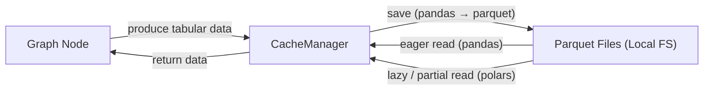

# Node Cache Manager Migration — Portfolio Case Study (Anonymized)

## Executive Summary
I replaced a legacy node-level cache with a new cache manager designed for **reliable local persistence** and **efficient access to large tabular data**.
The migration moved storage from a custom HDF5-based approach to **Parquet**, and introduced an optional **lazy/partial read path via Polars** for preview-like scenarios.
This cache is used to store intermediate datasets produced by nodes in a graph-based pipeline.

---

## What This Case Study Shows
- Production-grade migration work (not a greenfield project)
- Storage format redesign (HDF5 → Parquet)
- Efficiency features for large data (column/row subset reads)
- Backward compatibility and safe failure modes
- Clear separation between “cached data” and “remote references”

---

## Context
- **System:** graph-based pipelines where each node produces intermediate datasets
- **Cache location:** local filesystem
- **Data:** tabular (pandas / Arrow-compatible); some consumers need full reads, others need quick previews
- **Constraints:** avoid breaking existing flows; keep behavior predictable under errors

---

## My Contribution
- Designed and implemented the new `CacheManager` to replace a legacy implementation
- Migrated persistence from HDF5 + custom storage handler to Parquet
- Added a lazy/partial read path (`load_df_parquet_lazy`) using Polars
- Implemented metadata-driven save/load for node artifacts
- Added safety guards (e.g., warnings for incomplete data that should not be cached)
- Preserved compatibility considerations during the transition

---

## Problem
The legacy cache accumulated complexity and did not support evolving usage patterns well:
- a custom storage handler and HDF5 persistence increased maintenance overhead
- reads typically required full materialization, which was inefficient for large datasets
- the cache layout relied on special-case logic (separate input/output structure)
- interoperability with modern data tooling and formats was limited

---

## Solution Overview

The new cache manager is built around:
- **Parquet files** for cached datasets
- **metadata as the source of truth** for reconstructing node artifacts
- two access patterns:
  - **eager reads** via pandas for full materialization
  - **lazy/partial reads** via Polars for column/row slices

It also explicitly handles non-cached references (e.g., remote links) and avoids persisting incomplete, preview-only data.

---

## Representative Before → After
A structured comparison is available in `docs/before-after.md`.

Key highlights:
- **Storage format:** `.h5` + custom handler → `.parquet` via pandas/Arrow (with optional Polars reads)
- **Efficiency:** full reads → optional column/row subset reads for large tables
- **Layout:** input/output split → unified metadata-driven structure per node
- **Reliability:** clearer warnings and safer behavior for incomplete cache states

---

## Outcomes (Qualitative)
- Enabled partial access patterns for large cached datasets (useful for previews)
- Reduced unnecessary memory pressure by avoiding full materialization when not needed
- Simplified cache persistence logic and improved maintainability
- Made the cache layer easier to extend with additional controls (e.g., validation, naming rules)

---

## What Is Intentionally Omitted
- Company/product names and internal service boundaries
- Production datasets, identifiers, and exact performance numbers
- Infrastructure details unrelated to the cache design itself

This repository focuses on engineering decisions and migration strategy.

---

## Topics for Further Discussion (Optional)
- Cache design for graph-based pipelines
- Storage format trade-offs (HDF5 vs Parquet)
- Lazy vs eager reads, and when each is appropriate
- Backward compatibility strategies during migrations
